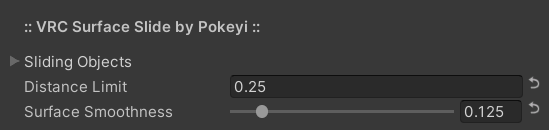

# [💾](https://github.com/Pokeyi/VRC-Surface-Slide/blob/main/P_SurfaceSlide.cs) VRC-Surface-Slide <!--  -->
Surface sliding object controller for VRChat.

## Overview
🚧 This project is functional but in early stages with additional features planned. 🚧

VRC Surface Slide is a single configurable UdonSharp behaviour that can be used to translate game objects' parent rotations into lateral movement.

It is intended to be efficient and relatively simple to use without the need for any additional editor scripts or dependencies outside of UdonSharp. All configuration can be done within the Unity Inspector window without the need for any programming, Udon, or SDK knowledge. That said, the source code is cleanly-organized and commented in the hopes of also being a good learning tool.

### Requirements
Errors regarding functions not being exposed likely mean you need an updated version of the SDK or UdonSharp.
- [Unity](https://docs.vrchat.com/docs/current-unity-version) (Tested: v2019.4.31f1)
- [VRChat Worlds SDK3](https://vrchat.com/home/download) (Tested: v2021.11.8)
- [UdonSharp](https://github.com/MerlinVR/UdonSharp) (Tested: v0.20.3)

### Optional
Components with functionality supporting this behaviour, should you like to use them.
- [VRC Floater Sync](https://github.com/Pokeyi/VRC-Floater-Sync) (Synced Floating Object Motion)

### Recommended
Other useful VRChat world-creation tools that I will always recommend.
- [World Creator Assistant](https://github.com/Varneon/WorldCreatorAssistant) (SDK & Package Management)
- [CyanEmu](https://github.com/CyanLaser/CyanEmu) (Unity-Window Testing)

### Setup
Make sure you have already imported the VRChat Worlds SDK and UdonSharp into your project.
- Download the latest [Unity Package](https://github.com/Pokeyi/VRC-Surface-Slide/releases) and import it into your project.
- A pre-configured example prefab is included that you can drop into your scene if you like.
- Create and select an empty game object.
- Add the P_SurfaceSlide behaviour via the Unity Inspector window or 'Component > Pokeyi.VRChat > P.VRC Surface Slide' toolbar menu.
- Click the 'Convert to UdonBehaviour' button if prompted.
- Click the small triangle next to Sliding Objects to expand the array. This is where you will reference each sliding object you want to move, all relative to their own parent object rotations.
- If the Size field is left at 0, you can lock the Inspector tab and drag the game objects into the Sliding Objects label to add them all to the array at once. You can alternatively enter a Size value and drag them in one at a time.
- Configure the rest of the behaviour's properties in the Inspector window as you see fit. Each of these is explained in detail further below.
- DO NOT use a separate copy of this behaviour for every sliding object, it is meant to control multiple objects with a single behaviour.

## Features
The main features of Surface Slide. All of the following properties have hover-tooltips in the Unity Inspector window.
- Sliding Objects - The array of game objects being affected by the behaviour. Each of these will slide relative to their own parent object rotations, they do not have to be parented by the object containing this behaviour.
- Distance Limit - Limits how far each object can slide from its origin point at start.
- Surface Smoothness - Overall speed multiplier at which each object will slide. Objects will appropriately slide faster at steeper angles.

### Use Case Examples
Basic examples for which you could use reactive sliding objects.
- Cargo sliding around on the deck of a moving ship.
- Items sliding on a table or other tipping surface.

### Notes
1. Object movement sometimes appears to vary between the VRChat build and Unity game mode (CyanEmu), something to take into consideration when testing.
2. This behaviour is NOT network synced, but can be effectively if the sliding objects are parented to objects which themselves use synced animations or movements.
3. DO NOT use a separate copy of this behaviour for every sliding object, it is meant to control multiple objects with a single behaviour.

## Credit & Support
Please credit me as Pokeyi if you use my work. I would also love to see your creations that make use of it if you're inclined to share. This and [related projects](https://github.com/Pokeyi/pokeyi.github.io#my-projects) have involved many months of solid work and self-education as I strive for an opportunity to change careers and make a better life for myself. If you find value in my work, please consider supporting me, I appreciate it more than you can imagine!

## License
This work is licensed under the MIT License.

Copyright © 2022 Pokeyi - https://pokeyi.dev - [pokeyi@pm.me](mailto:pokeyi@pm.me)

Permission is hereby granted, free of charge, to any person obtaining a copy
of this software and associated documentation files (the "Software"), to deal
in the Software without restriction, including without limitation the rights
to use, copy, modify, merge, publish, distribute, sublicense, and/or sell
copies of the Software, and to permit persons to whom the Software is
furnished to do so, subject to the following conditions:

The above copyright notice and this permission notice shall be included in all
copies or substantial portions of the Software.

THE SOFTWARE IS PROVIDED "AS IS", WITHOUT WARRANTY OF ANY KIND, EXPRESS OR
IMPLIED, INCLUDING BUT NOT LIMITED TO THE WARRANTIES OF MERCHANTABILITY,
FITNESS FOR A PARTICULAR PURPOSE AND NONINFRINGEMENT. IN NO EVENT SHALL THE
AUTHORS OR COPYRIGHT HOLDERS BE LIABLE FOR ANY CLAIM, DAMAGES OR OTHER
LIABILITY, WHETHER IN AN ACTION OF CONTRACT, TORT OR OTHERWISE, ARISING FROM,
OUT OF OR IN CONNECTION WITH THE SOFTWARE OR THE USE OR OTHER DEALINGS IN THE
SOFTWARE.
